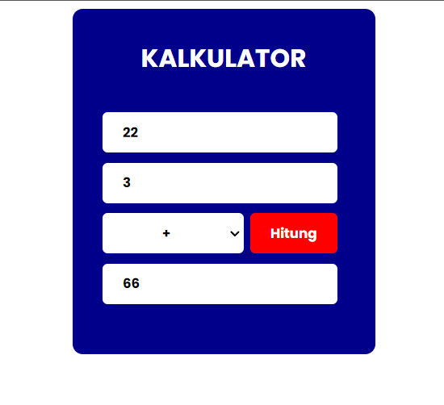

# APLIKASI SEDERHANA KALKULATOR


Ini adalah aplikasi yang membantu seseorang untuk menghitung operasi aritmatika yang terdiri dari tambah, kurang, kali, bagi. 



## Cara Memakai
1. Input bilangan 1 dan bilangan 2 kalian dibagian ``` kotak ```
2. Pilih operasi aritmatika
3. Klik tombol ``` Hitung ```
4. Setelah itu, akan muncul hasil ***``` Perhitungan ```*** nya